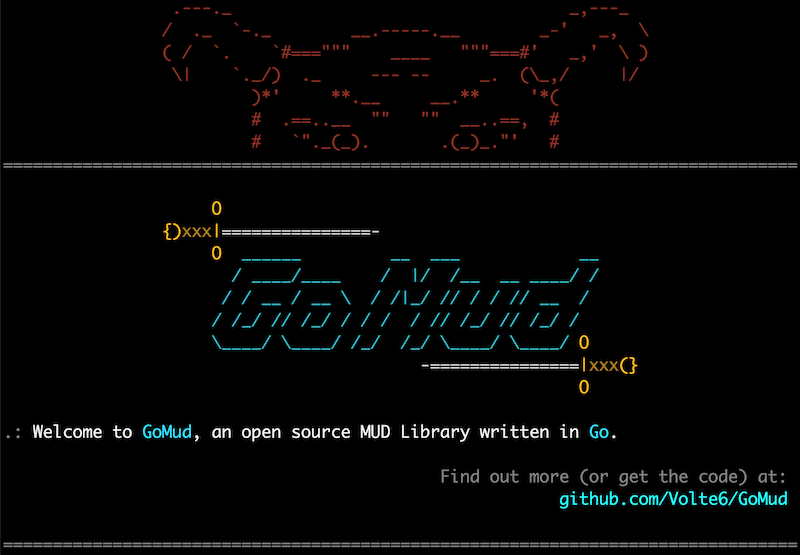

# GoMud

This is an early version of GoMud, having only been in development a couple of months.

## Screenshots

See some feature screnshots [here](webclient/images/README.md).

## ANSI Colors

Colorization is handled through extensive use of my [github.com/Volte6/ansitags](https://github.com/Volte6/ansitags) library.

Can be run locally as a standard go program or via docker container. The default port is `33333`, but can be run on multiple ports.

## Scripting

Information on scripting in GoMud can be found in the [scripting README](scripting/README.md).

## Small Feature Demos

- [Auto-complete input](https://youtu.be/7sG-FFHdhtI)
- [In-game maps](https://youtu.be/navCCH-mz_8)
- [Quests / Quest Progress](https://youtu.be/3zIClk3ewTU)
- [Lockpicking](https://youtu.be/-zgw99oI0XY)
- [Hired Mercs](https://youtu.be/semi97yokZE)
- [TinyMap](https://www.youtube.com/watch?v=VLNF5oM4pWw) (okay not much of a "feature")
- [256 Color/xterm](https://www.youtube.com/watch?v=gGSrLwdVZZQ)
- [Customizable Prompts](https://www.youtube.com/watch?v=MFkmjSTL0Ds)
- [Mob/NPC Scripting](https://www.youtube.com/watch?v=li2k1N4p74o)
- [Room Scripting](https://www.youtube.com/watch?v=n1qNUjhyOqg)
- [Kill Stats](https://www.youtube.com/watch?v=4aXs8JNj5Cc)
- [Searchable Inventory](https://www.youtube.com/watch?v=iDUbdeR2BUg)
- [Day/Night Cycles](https://www.youtube.com/watch?v=CiEbOp244cw)
- [Web Socket "Virtual Terminal"](https://www.youtube.com/watch?v=L-qtybXO4aw)

# Quick Start

A youtube playlist to getting started has been set up here:

[Getting Started Videos](https://i.ytimg.com/vi/OOZqX01aHt8/hqdefault.jpg)

You can compile and run it locally with:
> `go run .`

Or you can just build the binary if you prefer:
> `go build -o GoMudServer`

> `./GoMudServer`

Or if you have docker installed:
> `docker-compose -f provisioning/docker-compose.yml up --build --remove-orphans server`

## Connecting

*TELNET* : connect to `localhost` on port `33333` with a telnet client

*WEB CLIENT*: [http://localhost/client](http://localhost/client) 

**Default Username:** _admin_

**Default Password:** _password_

